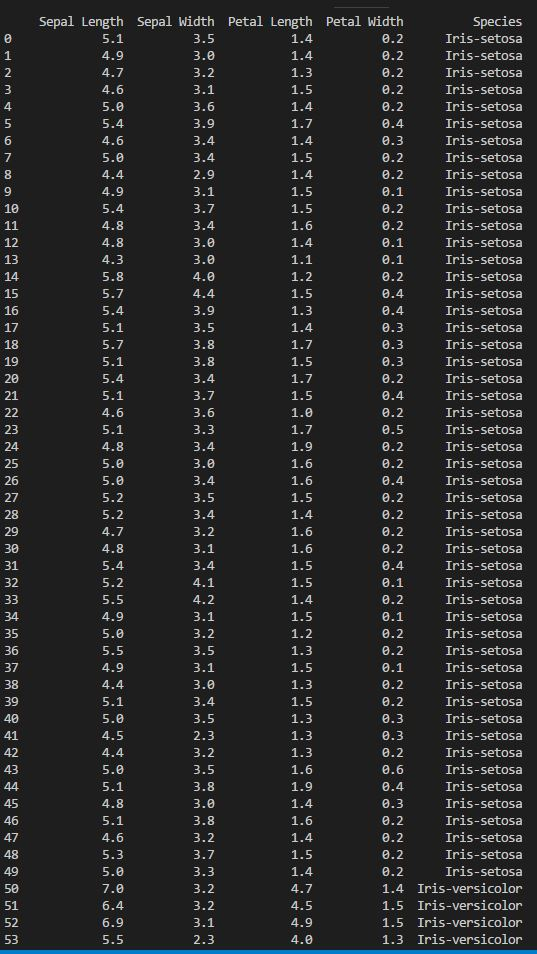
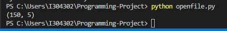
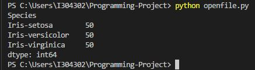
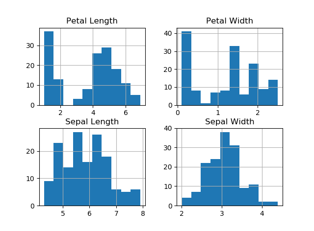
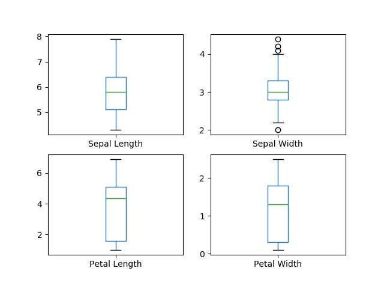
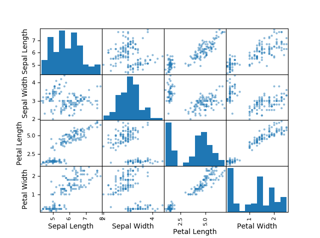
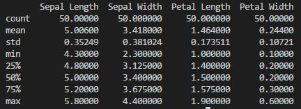
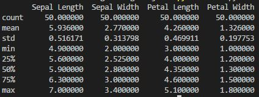
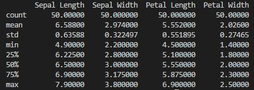

# Programming-Project

## Assigned project for programming &amp; scripting module 2018, Computer Science and Data Analytics, GMIT.
In this project I will be looking at the Iris data set. 
1) I will provide a brief summary of what the Iris data set is and what it contains. 
2) I will upload the data into Visual Studio Code to summarize and visualize the data set using the Python programming language in order to provide some analysis on the data.
3) I will provide a summary of my findings.

## 1. Fisher’s Iris Data Set

The [Iris data set](https://en.wikipedia.org/wiki/Iris_flower_data_set) or Fisher’s Iris data set is a [multiverse data set](https://en.wikipedia.org/wiki/Multivariate_statistics) introduced by the British statistician and biologist [Ronald Fisher](http://www.newworldencyclopedia.org/entry/Ronald_Fisher) in his 1936 paper *“The use of multiple measurements in taxonomic problems”*.
The data set consists of the measurements of four attributes of 150 iris flowers from three types of irises. There are four columns of measurements of the flowers in centimetres, sepal-length, sepal-width, petal-length and petal-width. The fifth column is the species of the flower observed.

#### Where to find the data set

The data set can be found from the [UCI Machine Learning Repository](https://archive.ics.uci.edu/ml/datasets/iris) 

#### The Python Libraries used

1) Numpy is the fundamental package for scientific computing with Python. besides it's scientific uses it can also be used as an efficient multi-dimensional container of generic data.
2) Pandas is a package providing fast, flexible and expressive data structures designed to make working with data both easy and initutive.
3) Matplotlib is a Python 2D plotting library which produces publication quality figures in a variety of hardcopy formats and interactive environments across platforms.
4) SK learn provides a range of supervised and unsupervised learning algorithms via a consistent interface in Python.

#### List of folders and their contents

1) openfile.py provides a look at all of the data in the uploaded iris.csv file.
2) mean.py calculates the average value of each column in the data set.
3) min.py calculates the minimum value of each column in the data set.
4) max.py calculates the maximum value of each column in the data set.
5) medi.py calculates the median value of each column in the data set.
6) easy.py is a much quicker way to calculate the above data. I only discovered this later in the project.
7) hist.py generates a histogram of the data.
8) whisk.py generates a box and whisker plot of the data.
9) scat.py generates a scatter plot of the data.
10) species.py splits the data into the three seperate species for further analysis.

## 2.1 A quick look at the data

Below is a brief look at some of the basic information of the data set as per the openfile.py file. 
The screenshots below show the layout of the data in Visual Studio Code

The total number of rows and columns in the data set

The species type and the number of flowers belonging to each species type in the data set.

## 2.2 A more detailed look at the data

Below shows a summary of the basic statistical data from the data set. This can be viewied in the easy.py file.

     
#### Histogram
Histograms are one of the most common graphs used to display numeric data. The important things that can be learned by looking at a histogram are:
1) If the left side of a histogram resembles a mirror image of the right side then the data is said to be symmetric, where the mean is said to be a good approximation for the centre of the data. 
2) If the data is not symetric, it is left skewered or right skewered, then the mean may not provide a good estimate for the centre of the data.
3) Outliers can be very high or low values that do not fall near any other data point. They can represent unusual cases or they may represent data errors.

Looking at the histogram information on the petal length and width, the data is very skewered. We can see there are quite a high number of the species with a petal lenth of 2cm or less and so the mean calculated of 3.758 is not necessarily a true reflection of the median of the data set. The same applies for the petal width. The sepal length and width appear to be more symmetric on the histogram and so the mean of the species is more accurate for these columns.

This can be backed up by looking at the mean petal length which is 3.75cm's whereas the median is 4.35cm's
 

#### Box and Whisker plot

Boxplots present information from a five-number summary. It does not show distribution in as much detail as other graphs but it is useful for indicating weather a distribution is skewed or whether there are potential unusual observations in a data set. This type of graph is also useful when large numbers of observations are involved and when two or more data sets are being compared.

For the petal length and width, we can see the medians are closer to the upper quartile range which again strengthens the information shown in the histogram that there are a high number of the species that have petal lengths and widths at the lower quartile of the data. The more central medians on the sepal length and width is a good indication of the more symmetrical data that was presented on the histograms for these columns.

#### Scatter plot

Scatter plots are similar to line graphs as they also use vertical and horizontal axes to plot data points. However the specific purpose of this grapg is to show how much one variable is affected by another(correlation). The closer the data points come when plotted to making a straight line, the higher the correlation between the two variables.

If the data points make a straight line from the axis origin, the relationship is said to have a positive correlation. This would appear to be the case between the petal lengths and widths of the species wherea as there appears to be no correlation between the sepal length and sepal widths of the species.

## 2.3 Splitting the data set

It is possible to break the data into three seperate segments to compare the three species of flowers specifically. See the species.py file. The below screenshots shows a summary of the basic statistical data from each of the three species of flower individually so they can be compared with each other.

The Virginica appears to be the largest of the three flower species with the largest petal length and width. 
The Setosa appears to be the smallest of the three flower species by a considerable way when looking at the size of it's petal length and width although it does have a larger sepal width than the other two species and it's sepal length is closer to the size of the other two species than the dimensions of it's petals.

#### The Setosa data

#### The Versicolor data

#### The Virginica data

## Summary

At the start of this project I set out with the daunting assumption that I would have to write lots of code in Python to analyze the data set and worse, turn this data into graphical information. After watching the relevant lecture videos on pandas and matplotlib, and after researching further on these and other Python libraries, it became clear that these libraries do most of the heavy lifting when it comes to data analysis and they also make plotting graphs relatively straight forward. It is clear to me that graphial analysis of data can provide additional insight to details that might not be picked up looking at a table of numbers. 

During this project I have learned how to use the python libraries to extract and present the data from a data set in a number of different graphs. However I would like to state that the focus of this module has been around writing code in Python and has not really touched on data analysis methodologies and techniques for analysing graphical information, so my observations on the data set is unfortunately very limited. 

During my research on this project I have encountered terminology such as Regression, Bayesian, Dimension Reduction, Instance Based and Clustering. I hope to develop further knowledge on these topics as the course progresses but for now my understanding of these concepts is limited to non-existant and so I was reluctant to incorporte them into this project as analysis tools as I felt this would lead to a level of complexcity that is currently outside of my understanding. 

#### References
References:
https://en.wikipedia.org/wiki/Iris_flower_data_set - Information on the Iris data set

http://www.idvbook.com/teaching-aid/data-sets/the-iris-data-set/ - Information on the Iris data set

http://archive.ics.uci.edu/ml/datasets/Iris - Iris data set can be downloaded here

http://www.newworldencyclopedia.org/entry/Ronald_Fisher - Information on Ronald Fisher

https://en.wikipedia.org/wiki/Multivariate_statistics - Explanation of Multivariate statistics

https://machinelearningmastery.com/machine-learning-in-python-step-by-step/ - Simple project on the Iris data set

http://rstudio-pubs-static.s3.amazonaws.com/269829_8285925c922e445097f47925b112841f.html - Case study on Iris data classification

http://www.numpy.org/ - Description of Numpy

https://pandas.pydata.org/pandas-docs/stable/ - Description of Pandas

http://pythonforengineers.com/introduction-to-pandas/ - Introduction to Pandas

https://matplotlib.org/ - Description of Matplotlib

https://machinelearningmastery.com/a-gentle-introduction-to-scikit-learn-a-python-machine-learning-library/ - Description of SK learn

https://www.novixys.com/blog/pandas-tutorial-select-dataframe/ - More information on Pandas specifically how to extract information on specific rows of data only

http://www.developintelligence.com/blog/2017/08/data-cleaning-pandas-python/ - Information on the Pandas library

https://www.youtube.com/watch?v=uIcime2nBjs - Video showing how to display all columns in the data set in Python

http://blog.minitab.com/blog/michelle-paret/3-things-a-histogram-can-tell-you - Information on histograms

https://www.statcan.gc.ca/edu/power-pouvoir/ch12/5214889-eng.htm - Information on box and whisker plots

http://mste.illinois.edu/courses/ci330ms/youtsey/scatterinfo.html - Information on scatter plots.

