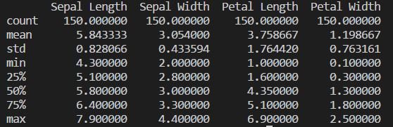

# Programming-Project

### Assigned project for programming &amp; scripting module 2018
In this project I will be looking at the Iris data set. 
1) I will provide a brief summary of what the Iris data set is and what it contains. 
2) I will upload the data into Visual Studio to summarize and visualize the data set using the Python programming language.
3) I will evaluate some algorithms and make some predictions from the analysis of the data through Visual Studio.

#### Fisher’s Iris Data Set

The [Iris data set](https://en.wikipedia.org/wiki/Iris_flower_data_set) or Fisher’s Iris data set is a [multiverse data set](https://en.wikipedia.org/wiki/Multivariate_statistics) introduced by the British statistician and biologist [Ronald Fisher](http://www.newworldencyclopedia.org/entry/Ronald_Fisher) in his 1936 paper *“The use of multiple measurements in taxonomic problems”*.
The data set consists of the measurements of four attributes of 150 iris flowers from three types of irises. There are four columns of measurements of the flowers in centimetres, sepal-length, sepal-width, petal-length and petal-width. The fifth column is the species of the flower observed.

#### Where to find the data set

The data set can be found from the [UCI Machine Learning Repository](https://archive.ics.uci.edu/ml/datasets/iris) 

#### List of folders and their contents

1) openfile.py provides a look at all of the data in the uploaded iris.csv file.
2) mean.py calculates the average value of each column in the data set.
3) min.py calculates the minimum value of each colunm in the data set.
4) max.py calculates the maximum value of each column in the data set.
5) easy.py is a much quicker way to calculate the above data. I only discovered this later in the project.

#### Looking at the data

     
      
     

